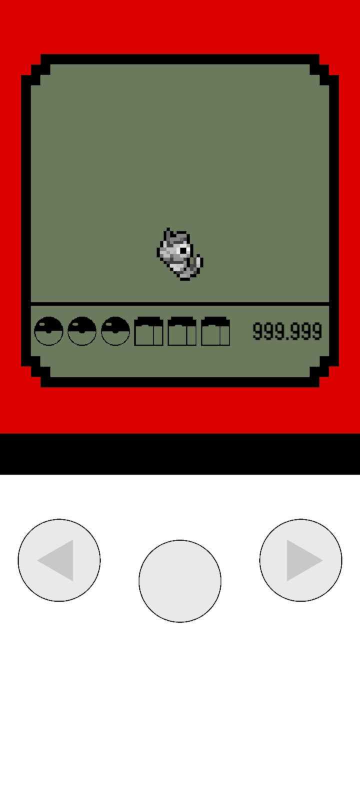
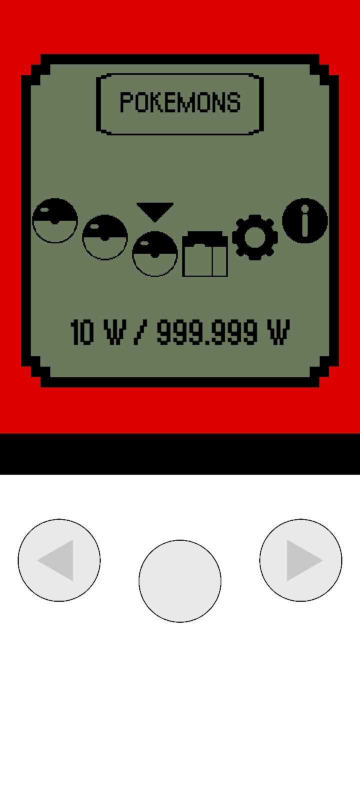
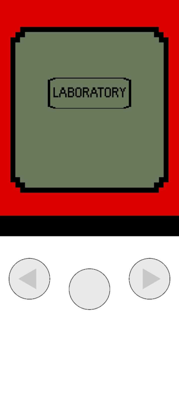
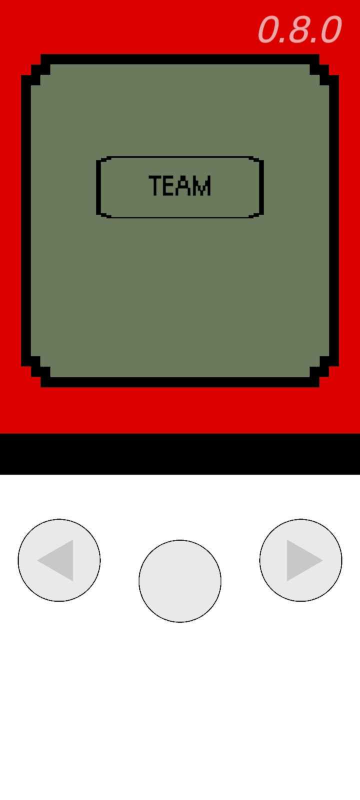
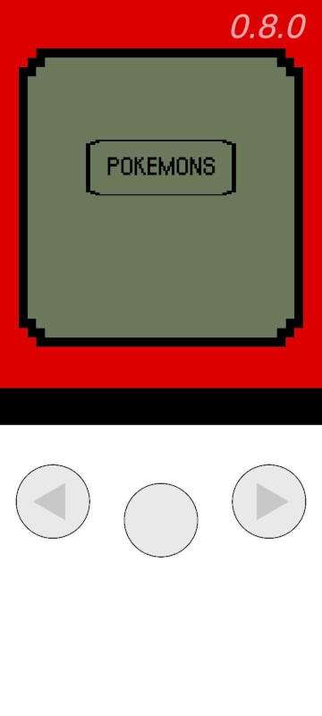
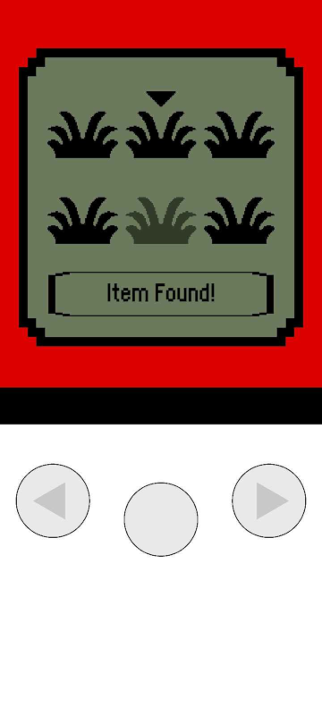
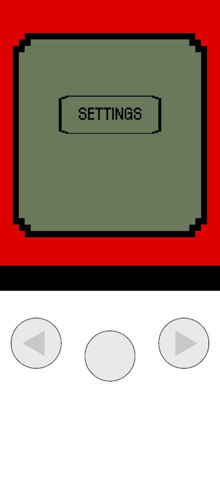
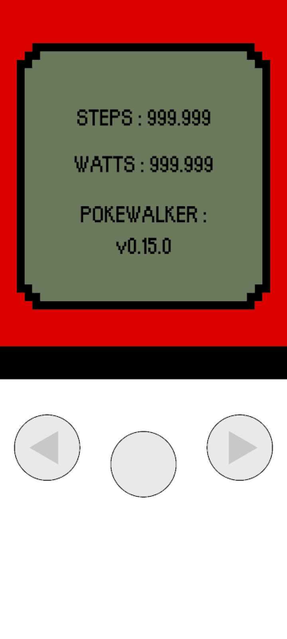

# _F6X POKEWALKER_

- **DESCRIPTION :**
  - **Pokewalker game like in Unity.**
  - **This project is for learning purposes only.**

---

- **CONTROLS :**
  - **Click : `TAP`**

---

- **STACK :**
  - **F6X Pokewalker** : `0.15.0`
  - **Android** : `8.0`
  - **Unity** : `2022.3.20f1`
  - **Console Log System** : `1.3.0`

---

- **CREDITS :**
  - **Author : [FANTAS666X](https://github.com/FANTAS666IXI)**
  - **Sprites : [FANTAS666X](https://github.com/FANTAS666IXI), [WikiDex](https://www.wikidex.net/wiki/WikiDex)**